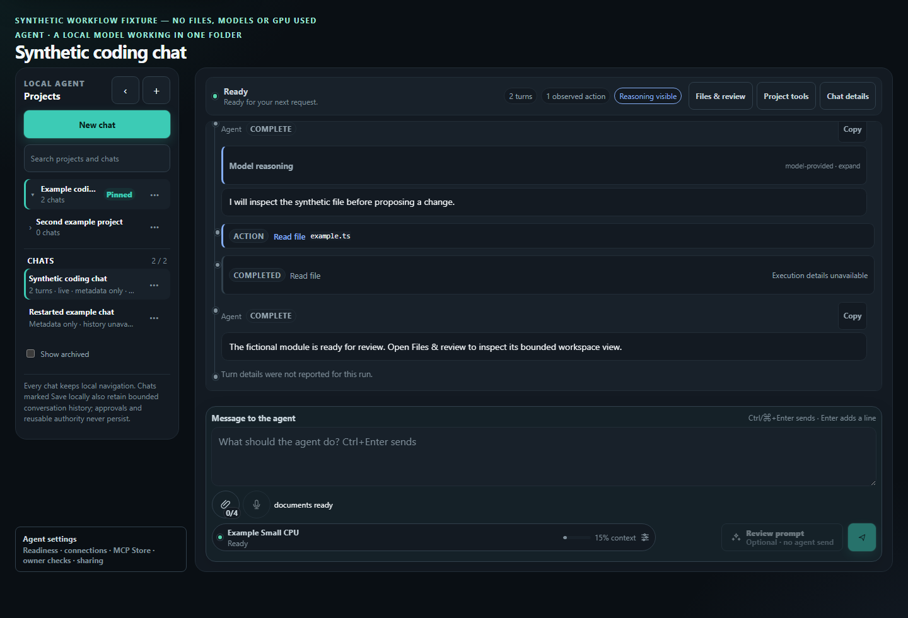
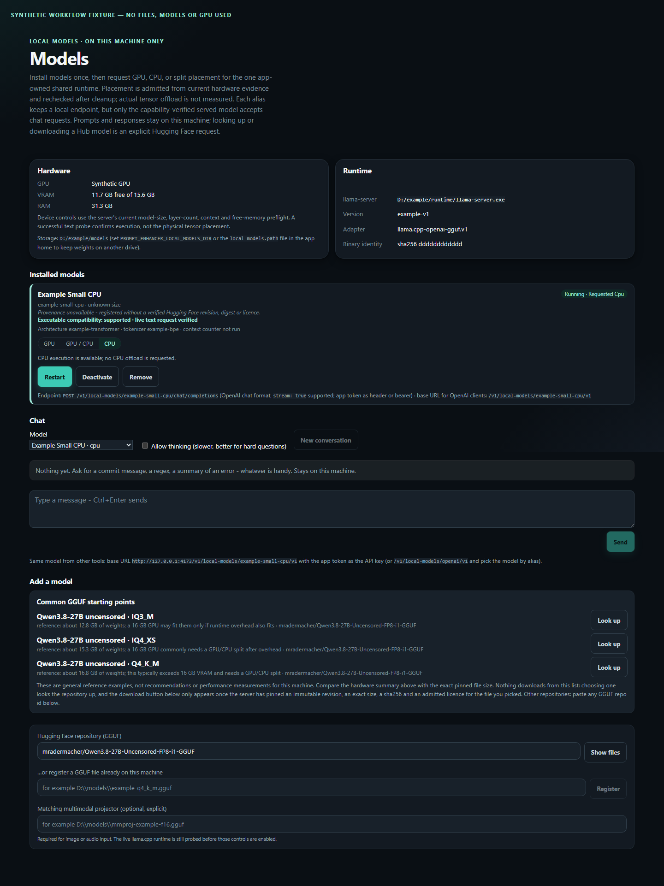
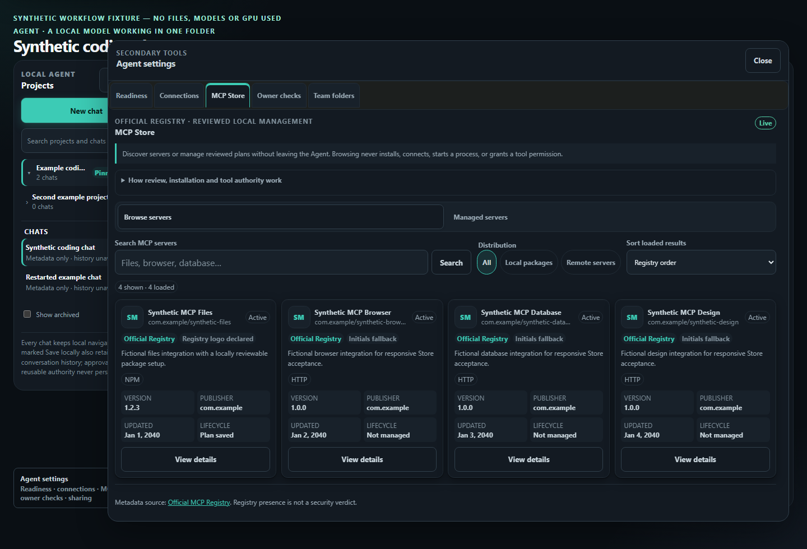
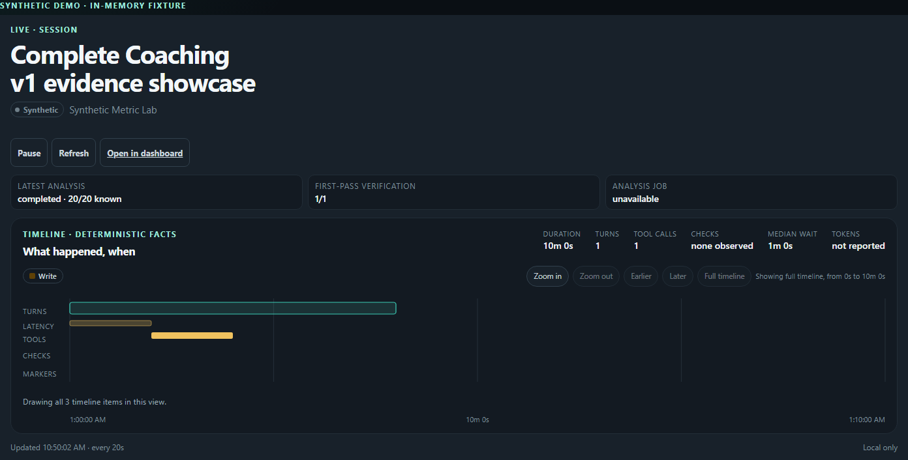
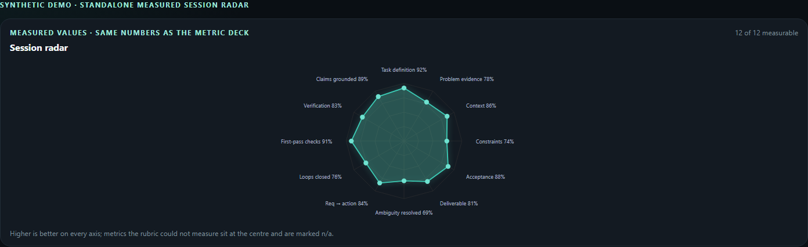
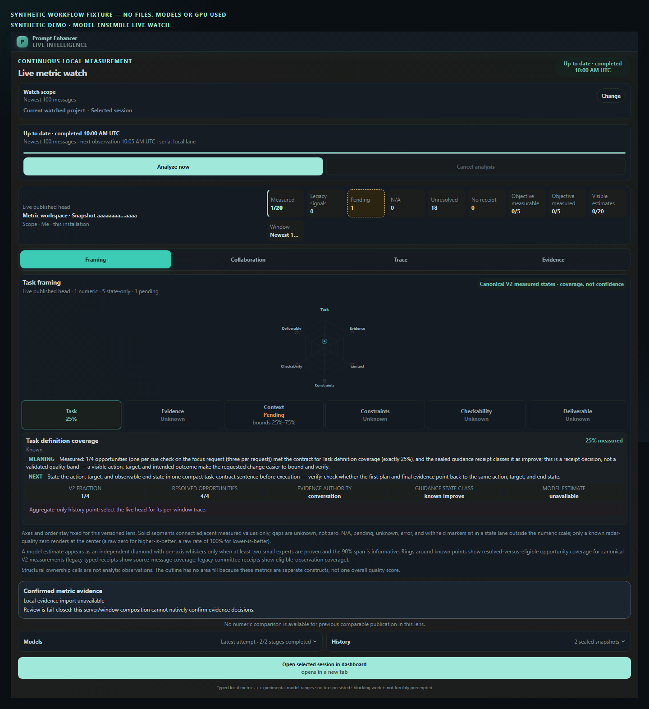

# Prompt Enhancer

Prompt Enhancer is a local-first workspace for understanding and improving coding-agent work. It brings consented, local signals from Codex and Claude Code together with an authored local Agent workspace, prompt checks, and evidence-aware analytics. It is designed to help people inspect work—not to rank developers or turn an assistant's claim into proof that a task is done.

The repository is public and privacy-sensitive. Its fixtures, examples, and gallery use fictional data only.

## Contents

- [What it does](#what-it-does)
- [Product tour](#product-tour)
- [Gallery](#gallery)
- [Analytics and the live mini radar](#analytics-and-the-live-mini-radar)
- [Privacy and egress boundaries](#privacy-and-egress-boundaries)
- [Quick start](#quick-start)
- [Architecture](#architecture)
- [Current status and limitations](#current-status-and-limitations)
- [Development and verification](#development-and-verification)
- [Documentation](#documentation)
- [License](#license)

## What it does

Prompt Enhancer has two complementary local surfaces:

- **Analytics** imports only user-consented provider data through bounded, read-only adapters. It presents task flow, outcome evidence, prompt structure, verification behavior, token and time fields when available, and explicit metric provenance.
- **Agent workspace** lets an active local model work in a folder you choose. Reads are bounded; proposed writes, commands, web fetches, and other protected effects wait for native human approval. The app can show a diff and evidence for the exact reviewed action rather than treating a model response as an executed change.

It also includes a prompt check, local-model runtime controls, durable projects and chats, artifact views, and carefully scoped MCP connections. Each capability has a distinct data and authority boundary.

## Product tour

### Overview and analytics

The dashboard turns consented events into separate, versioned dimensions: task framing, collaboration, reasoning trace, outcome evidence, operational flow, and data quality. It keeps objective evidence—such as a verified test, build, artifact, or explicit acceptance—separate from inferred text assessments. There is no universal prompt score, developer score, or “intelligence” ranking.

Codex support uses a bounded App Server boundary for consented discovery and selected reads. Claude Code support includes an opt-in, read-only local source plus optional hooks/telemetry pathways. Provider adapters do not delete, archive, resume, rename, or otherwise mutate provider sessions. Unsupported provider shapes and missing fields remain visible as unavailable rather than being invented.

### Projects, chats, and the local Agent

The Agent surface organizes durable local projects and chats around a selected workspace and local runtime. A chat can be metadata-only or explicitly opt in to bounded local history. Retained history is sensitive local data; approvals, staged inputs, and reusable mutation authority do not survive recovery.

The model can propose folder-scoped work, while protected effects remain human decisions. The UI supports bounded inspection, reviewable diffs, reviewed file and folder operations, content-free change-set and artifact metadata, and selected artifact viewers. A completion message is not verification: an effect is reported only when the corresponding local operation has an appropriate receipt.

### Local runtimes

The Models surface manages compatible local model runtimes and exposes an OpenAI-compatible loopback endpoint for an active runtime. Runtime capability claims are probed and versioned; unsupported model, tokenizer, architecture, image, or audio combinations stay unavailable. The detailed setup and client boundary are in [Local models and agent access](docs/local-models-and-agent-access.md).

### MCP, deliberately split by purpose

There are two separate MCP directions:

- The analytics MCP surface is bounded and read-only. It can return defined metrics and calibration status, but never raw transcripts, filesystem paths, provider credentials, tool arguments/results, or a generic database query.
- The Agent MCP surface lets a locally authorized controller coordinate selected project/chat operations. It uses a scoped connection created in the native Agent window; it cannot silently approve protected workspace effects. Direct HTTP MCP calls the already-running loopback app, while the stdio bridge is an advanced fallback.

Anything returned to an external coding agent enters that agent's context. The app requires the relevant explicit acknowledgement or task-specific authorization before such a boundary is opened. See the [Agent controller API](docs/agent-controller-api.md) and [ADR 0014](docs/adr/0014-read-only-agent-surface.md).

## Gallery

Every gallery image is a rendered synthetic fixture with fictional labels, values, paths, and conversation content—not a screenshot of a provider session or a local machine. These are static PNGs for GitHub, not embedded interactive windows or live application state.



The local Agent keeps project/chat context, proposed workspace work, and human review as distinct states.

| Local model management | MCP Store registry browsing | Live mini window |
| --- | --- | --- |
|  |  |  |
| The Models page presents local runtime readiness and model-management controls. | The MCP Store presents a bounded browse/review flow for registry entries; it is not a scoped Agent-connection view. | A static render of the floating local watch window; it is not a live session embedded in this README. |

| Session radar |
| --- |
|  |
| An illustrative selected-session measurement view. Missing and ineligible values remain states, not fabricated scores. |

<details>
<summary>Model-ensemble overlay — synthetic 20-metric contract view</summary>



This static overlay shows a grouped lens and its measured scope (`1 / 20` in this fixture). It does not claim that all 20 contracts are simultaneously measured or plotted as one score.
</details>

## Analytics and the live mini radar

The Quality Profile and floating mini radar make the measurement model visible while work is in progress:

- Solid points and lines represent evidence-backed deterministic measurements with typed numerators, denominators, coverage, and provenance.
- An indigo marker and range, when present, are a separate **Experimental model range** from local model projections. It is not a confidence claim, a probability of truth, or a replacement for evidence.
- The product defines twenty separately versioned metric contracts across grouped lenses; a radar or overlay shows only its measured, eligible scope and states. `0%` means an eligible denominator was observed and no positive factor was found. `—`, Unknown, Pending, Not applicable, and execution-error states are gaps—not zero.
- Only verified objective receipts can establish a solid verified-outcome value. Model output and an assistant's “done” message cannot do that on their own.

The live watch is explicitly selected, bounded, and local. It uses a sealed immutable analysis receipt, reuses an unchanged result rather than generating fake history, and publishes a new receipt only for changed eligible input. Current text analysis is bounded to the newest 100 admitted messages / 100,000 redacted characters; it is not a claim of complete session coverage. Local model estimates are experimental until the relevant calibration and resource gates pass.

Read the complete metric, uncertainty, resource, and rollout contract in [the live metric radar pipeline](docs/live-metric-radar-pipeline.md), plus definitions in [the metrics catalog](docs/metrics-catalog.md).

## Privacy and egress boundaries

“Local” is not a blanket privacy claim. Prompt Enhancer distinguishes these routes:

| Surface | What is local | What requires an explicit separate choice |
| --- | --- | --- |
| Analytics | Consent-scoped, minimized provider metadata and derived metrics live in local storage. Full paths, credentials, previews, and raw tool content are excluded from normal analytics persistence. | A selected content analysis requires fresh confirmation, local redaction, bounded input, and content-free stored results. |
| Authored chats | Project/chat metadata is durable locally. Conversation content is retained only for a chat that explicitly opts in to bounded local history. | Sharing that context with a network-backed controller/model requires task-specific egress authorization and a redaction preview. |
| MCP | The analytics server is allowlisted and read-only; the Agent server uses revocable scoped connections. | Returned data enters the connected agent's context. Protected effects still require native human approval and cannot be approved over MCP. |
| Local runtime | The app-facing runtime endpoint is loopback-only. | Downloading a model, connecting a remote annotation provider, or using a network-backed controller is a distinct network/egress decision. |

Redaction reduces exposure; it is not anonymization, encryption, or a guarantee that every secret or business fact will be recognized. Derived metrics, labels, summaries, and embeddings can still be sensitive. See [PRIVACY.md](PRIVACY.md), [SECURITY.md](SECURITY.md), [the text-analysis privacy boundary](docs/privacy-text-analysis.md), and [ADR 0011](docs/adr/0011-owner-authorized-session-reader.md).

## Quick start

Requirements: Python 3.11+, [uv](https://docs.astral.sh/uv/), and the frontend's locked Node.js 24+ / npm 11+ toolchain. Use the repository's `uv` environment rather than a globally activated Python environment.

From the repository root in PowerShell:

```powershell
uv lock --check
uv sync --frozen --extra dev
uv run --frozen --extra dev prompt-enhancer init
uv run --frozen --extra dev prompt-enhancer demo
uv run --frozen --extra dev prompt-enhancer status

Set-Location frontend
npm ci
npm run build
Set-Location ..
```

`demo` creates only deterministic fictional data. It does not read a provider, download a model, or send data to a network service.

To run the local application after setup:

```powershell
uv run --frozen --extra dev prompt-enhancer serve
```

The server binds to loopback. Production dashboard assets are served after `npm run build`; the ordinary Vite development profile is synthetic. Consent, provider indexing, selected-session analysis, model download, and any remote annotation route are separate user actions.

For local source and provider-specific setup, use [Phase 1](docs/phase-1.md). For local models, direct MCP setup, and the Agent workspace, use [Local models and agent access](docs/local-models-and-agent-access.md).

## Architecture

```text
Consented local providers / authored workspace
                 |
                 v
       bounded adapters + redaction gates
                 |
                 v
  local SQLite metadata, evidence, provenance, metrics
          |                          |
          v                          v
  loopback React dashboard     allowlisted/scoped MCP
          |
          v
native review for protected workspace effects
```

The implementation is a modular monolith with explicit ports around providers, local files, models, and networked services. Ingestion adapters are read-only; provenance is versioned; missing values are not coerced into failures or zero. The wider rationale and decisions live in [Architecture](docs/architecture.md) and [the ADR index](docs/adr/README.md).

## Current status and limitations

This is an actively developed local vertical slice, not a general-purpose provider replacement or a fully calibrated analytics product.

- The default development experience is synthetic. Real provider access requires explicit consent and depends on the provider adapter's supported schema/version.
- Selected-session text analysis is bounded and redacted in memory; it does not imply complete history or transcript retention. The current public preset has a 100-message / 100,000-character limit.
- The twenty metric contracts keep deterministic evidence and experimental model ranges intentionally separate. Calibration, full-session completeness, and some optional model/runtime capabilities remain gated work.
- Local models are compatibility-checked rather than universally supported. Optional model acquisition and evaluation are separate from the normal quick start.
- The Agent supports intentional, reviewable local work but does not make completion claims for unverified model text or external effects. Native approval is required for protected actions.
- Team, remote annotation, update, and third-party MCP-store surfaces have their own staged readiness and network boundaries; do not interpret a UI entry as an unconditional production-service claim.
- The current application updater is verify-only (`can_apply: false`). Production signing, installation, relaunch, and rollback remain pending; pushing to `main` never updates an installed copy.
- Windows-native desktop launchers and loopback ownership have dedicated contracts; other platforms and distribution paths have narrower current support.

The feature/register and completion work are tracked in [the owner feature register](docs/prompt-enhancer-owner-feature-register-2026-08-31.md) and [the finish goal](docs/prompt-enhancer-finish-goal-2026-08-29.md).

## Development and verification

Use only fictional fixtures and reserved example values. Do not read or commit provider configuration, credentials, transcripts, local source snippets, runtime databases, screenshots, or account data. The sole screenshot exception is a reviewed, hash-pinned synthetic gallery capture in `docs/images`; it must contain no real local or provider data.

The local parity commands are:

```powershell
uv lock --check
uv sync --frozen --extra dev
uv run --frozen --extra dev python -m compileall -q src tests scripts
uv run --frozen --extra dev python -m pytest
python scripts/privacy_scan.py

Set-Location frontend
npm ci
npm test
npm run check:api
npm run build
npx playwright install --with-deps chromium
npm run test:e2e
```

The browser-install command is only needed for the end-to-end suite. See [the CI quality gate](docs/ci-quality-gate.md) for platform-specific security preflights and [CONTRIBUTING.md](CONTRIBUTING.md) for the public-data checklist.

## Documentation

- [Private browser deployment with Coolify](docs/coolify-deployment.md)
- [Phase 1 local workflow](docs/phase-1.md)
- [Live metric radar contract](docs/live-metric-radar-pipeline.md)
- [Metrics catalog](docs/metrics-catalog.md)
- [Local models and Agent/MCP access](docs/local-models-and-agent-access.md)
- [Local Agent controller API](docs/agent-controller-api.md)
- [Privacy policy](PRIVACY.md) and [security policy](SECURITY.md)
- [Architecture](docs/architecture.md) and [recorded decisions](docs/adr/README.md)

## License

No `LICENSE` file is currently present. Until one is added, this repository grants no reuse license.
