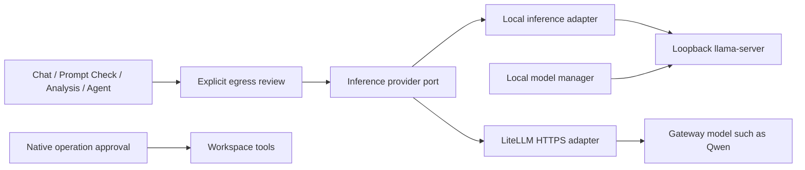

# ADR 0022 — Separate inference providers from owned model runtimes

Status: proposed for owner review. Implemented on a feature branch based on
`main` at `6fa1100`; neither merge nor live deployment is implied.
Date: 2026-10-09.

## Context and proposed supersession

ADRs 0013, 0015 and 0016 couple feature selection to an owned local model's
availability even though llama-server already receives requests over HTTP.
An owner-managed LiteLLM gateway should be usable by chat, Prompt Check,
explicit session interpretation/judging and Agent turns without pretending to
own a process, GPU, model file or runtime probe on the application host.

This proposal changes their inference-selection boundary. It also proposes a
narrow exception to ADR 0011's no-network session-text boundary: a user may
explicitly review and send one redacted analysis request. Automatic ingestion,
index refresh, calibration sweeps and background analysis retain local behavior.
Owner acceptance is still needed to supersede accepted architectural defaults.
Native operation approval and read-only provider access are unchanged.

## Decision proposed

Features depend on the application `InferenceProvider` port. The registry routes
stable model IDs; it cannot download, activate, switch or stop a model. A local
adapter delegates inference to the existing loopback runtime. A LiteLLM adapter
owns bounded HTTPS completion and streaming, TLS validation, server-side
credentials, timeouts, sanitized errors and cancellation. Composition is in
`bootstrap.py`; application contracts import no transport or runtime manager.
A failed local catalog does not prevent selecting an available external provider.

Shared inference requests are bounded and redacted before preview. Approval is
short-lived, single-use and bound to the model descriptor, redactor version,
purpose and exact prepared request. Preview performs no model call. Editing a
request, changing its model, restarting the application or expiry requires a
fresh preview. Agent turns pause before **each** external inference step, so
new tool results cannot leave the host under the initial prompt's approval.
Stopping a turn releases its pending review. Review never grants write, command,
MCP or native execution authority. Prompt Check retains its existing separate
preview contract while sharing the transport adapter.

Models report `configured`, not measured reachability, for gateway availability.
Revision, license, tool qualification and context count remain unknown unless
provided or measured; no local-runtime capability is fabricated. Provider/model,
adapter and redactor provenance accompanies results. Existing session judgments
store this provenance in their model-identity field and remain separate from
objective metrics. Manually supplied text and results are ephemeral and do not
create imported sessions or objective metrics.

## Hosting consequences

A shared gateway is useful for central GPU capacity and model administration.
Running the dashboard on a server also gives browser access to Prompt Check,
chat and explicitly supplied analysis text. It cannot discover a visitor's
local coding sessions, repositories or files. Agent workspaces belong to the
application host. A browser cannot replace the existing native approval host.

For local coding analytics and workspace tools, the useful topology is a local
Prompt Enhancer application using a shared inference gateway. Keep ingestion,
private storage and native approvals on the user's device while managing model
compute centrally. A fully hosted application requires manual input or a future
explicit ingestion design. This change does not establish tenant isolation,
authenticated per-user workspace allocation, a workflow engine or remote native
approval. Default service binding remains loopback.

## Alternatives and tradeoffs

- Reusing a fake local model/process record would mix lifecycle and inference
  and advertise capabilities the app cannot verify. It is rejected.
- A separate gateway client inside every feature would duplicate credentials,
  cancellation and request policy. One adapter plus explicit feature review
  keeps those concerns centralized.
- Per-step Agent review adds interaction cost, especially with tools. Removing
  it would require a separately reviewed privacy/authorization design.
- Automatic local analysis stays separate from explicitly selected inference,
  avoiding a configuration change that silently exports existing transcripts.

## Change card and evidence

Affected atlas nodes: MA17/MA18 and A05/A06/A08/A09/A13/A15. Sources are the new
application inference/review/manual-analysis modules, local/LiteLLM adapters,
inference HTTP routes, existing composition and frontend inference controls.

Synthetic tests cover unavailable local runtimes, exact request binding,
redaction failure, single-use concurrent replay, authenticated preview/stream,
CSRF, manual analysis, judgment provenance, per-step Agent tool-result review,
stop/decline, TLS pinning, stream limits and cancellation. Existing runtime,
Agent and model-judge regressions exercise compatibility. Exact command outcomes
are recorded in the journal; mocked inference is not real-model qualification.

Before acceptance: review the privacy supersession, run the proposed features
against the selected gateway with fictional inputs, and verify gateway retention,
model revision and tool-call behavior. Native, multi-user and release gates remain
open. Operational configuration is in [the gateway guide](../litellm-prompt-check.md).
