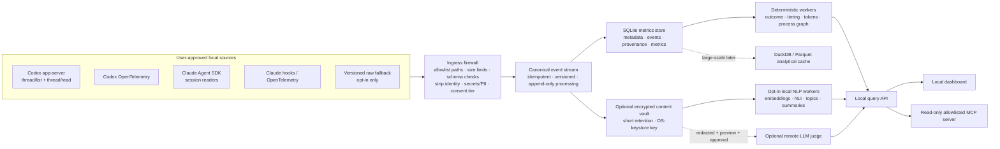

# Architecture proposal

Status: discussion draft 0.1
Reviewed against current provider documentation: 2026-08-06
Implementation structure accepted in
[ADR 0001](adr/0001-modular-monolith-hexagonal-metric-graph.md): modular monolith,
hexagonal boundaries, and an explicit trusted metric dependency graph.

## 1. Product boundary

Prompt Enhancer should be a local analytics system, not a replacement client for Codex or Claude Code. It reads user-approved historical or live events, normalizes them, computes reproducible metrics, and presents coaching and workflow evidence. It should not own the user's provider credentials, mutate provider sessions, or silently relay conversations to another model.

The valuable product is an evidence graph:

```text
request -> requirements -> plan/decisions -> actions -> verification -> outcome
```

That graph supports questions such as:

- Which prompt constraints were acted on or missed?
- Where did a task spend time and tokens?
- Which tool/test loops created rework?
- Did later instructions contradict or legitimately supersede earlier ones?
- What objective evidence supports “done”?
- Are trends changing within comparable task types?

A universal “prompt accuracy” number would hide these distinctions and invite gaming. The UI should show a profile of separately versioned dimensions.

## 2. Proposed system



The ingress firewall is the main trust boundary. Redaction after persistence is too late.

## 3. Provider adapters

### 3.1 Adapter contract

```text
probe()                     -> provider/version/schema/capabilities, no content
list(scope, cursor)         -> metadata-only session page
read(session, detail)       -> stream canonical events
watch(sink)                 -> optional live events
health()                    -> diagnostics without secrets
```

The interface deliberately excludes delete, archive, rename, resume, prompt submission, arbitrary SQL, and credential access.

Every adapter reports:

- provider and installed version;
- adapter and decoder version;
- supported and unknown event types;
- content/metadata capabilities;
- whether token fields are provider-reported or estimated;
- source retention limitations;
- compatibility warnings.

### 3.2 Codex

Preferred historical reader: launch the installed `codex app-server` over stdio
and use `initialize`, `thread/list`, and `thread/read` with turns included. OpenAI
describes app-server as the interface behind rich Codex clients; it can read stored
threads without resuming them. `thread/list` can include a user-text `preview`, so
even an index-only call requires the content-bearing `local-history` consent scope.
The boundary drops `preview` while retaining only the explicit `thread.name` as a
bounded secret-backed label. Only the final working-directory component becomes a
project label; the full path is HMACed for identity and is never persisted or exposed.
Use the default stdio JSONL transport; WebSocket is experimental and unnecessary.
Generate schemas from the installed CLI version rather than assuming one global wire

Preferred content-free live source: opt-in OpenTelemetry to a loopback collector. Codex telemetry exposes request/tool duration, success/failure, token categories, approvals, and prompt length while prompt content is redacted by default. The collector must still minimize identity/path fields before writing.

Compatibility fallback: direct session/rollout JSONL reading, isolated behind exact provider-version fixtures. Codex hooks explicitly document that `transcript_path` is convenient but the transcript format is not stable. Never read `auth.json`, internal state SQLite, logs, or broad `CODEX_HOME` contents. See [Codex hooks](https://learn.chatgpt.com/docs/hooks) and [advanced configuration](https://learn.chatgpt.com/docs/config-file/config-advanced).

Open questions that require installed-version tests:

- whether every desktop-created or cloud-only task appears in local `thread/list`;
- how archived, forked, compacted, and subagent threads are represented;
- which item/token events are available without experimental capabilities;
- what strict offline behavior app-server has when reading stored threads.

### 3.3 Claude Code

Preferred historical reader: the official Agent SDK session-browser helpers (`list_sessions`, `get_session_info`, and `get_session_messages`, with TypeScript equivalents). They read local CLI/SDK sessions without starting an agent or making an inference request. See Anthropic's [session-browser cookbook](https://platform.claude.com/cookbook/claude-agent-sdk-05-building-a-session-browser).

Preferred live sources:

- OpenTelemetry for content-free usage, cost, active time, token, tool, and lifecycle events;
- narrowly scoped hooks for selected prompt/tool/compaction/end fields not present in default telemetry;
- structured `stream-json` when Prompt Enhancer explicitly launches a future SDK workflow.

Anthropic documents full plaintext conversation transcripts under `~/.claude/projects/` (or `CLAUDE_CONFIG_DIR`), including messages, tool calls, and tool results. It also warns that anything passing through a tool can land on disk. See the [Claude directory and application-data reference](https://code.claude.com/docs/en/claude-directory), [hooks reference](https://code.claude.com/docs/en/hooks), and [monitoring reference](https://code.claude.com/docs/en/monitoring-usage).

Claude OpenTelemetry deserves special handling: current standard event attributes can include user email, account identifiers, installation identifier, terminal type, and workspace host paths. Our loopback collector must drop or HMAC these at ingress. Prompt content and tool details remain disabled by default.

Compatibility fallback: a streaming JSONL decoder restricted to selected project/session paths, versioned and tested for concurrent append, truncation, rotation, nested subagents, large spilled tool results, and compaction. Exclude `.claude.json`, settings, plugins, file history, debug data, caches, and prompt-recall history.

### 3.4 Source priority

| Priority | Surface | Use | Risk |
|---:|---|---|---|
| 1 | Supported local reader | Historical structure/content after consent | Provider schema evolves but is intended for clients/readers |
| 1 | Content-free OpenTelemetry | Operational metrics and live timing | Identity fields may still leak; collector must filter |
| 2 | Provider hooks | Incremental fields and end/compaction signals | Changes user configuration; explicit opt-in and diff required |
| 2 | Structured SDK/CLI stream | Workflows launched through Prompt Enhancer | Covers future managed runs, not all old interactive history |
| 3 | Raw transcript parser | Backfill unavailable fields | Unstable format and highest secret/content exposure |

## 4. Canonical data model

Provider data should normalize into events without flattening forks, subagents, or compaction.

### 4.1 Core entities

| Entity | Key fields | Notes |
|---|---|---|
| `provider_installation` | HMAC pseudonym, provider, version, capabilities | No email, hostname, account ID, or raw home path |
| `project` | HMAC pseudonym, optional private display label, task taxonomy | Label is only the final path component; raw local path remains outside the metrics DB |
| `session` | pseudonymous source ID, optional private display label, parent/fork IDs, start/end, terminal state | Label is the explicit provider task name; identity and outcome never derive from it |
| `turn` | session, actor, timestamps, sequence, content reference | Content reference may be null at Tier 1 |
| `event` | kind, timing, outcome, tool category, provenance | Canonical, append-oriented record |
| `usage` | input/cached/cache-created/output/reasoning/total, model, scope | Missing is `unknown`; reported vs estimated is explicit |
| `requirement` | normalized requirement, source span, type, version | Created by rules/LLM then reviewable by user |
| `evidence` | requirement, event/artifact/verification reference, strength | Makes completion claims auditable |
| `metric_result` | definition version, value, uncertainty, coverage | Immutable result; recomputation creates a new version |
| `model_run` | model/revision/tokenizer/license, parameters, rubric, inputs hash | Required for reproducibility |
| `consent_grant` | scope, tiers, destination, start/end | Versioned and revocable |
| `redaction_record` | detector version, types/counts, no matched value | Never log the secret or PII itself |

### 4.2 Canonical event kinds

```text
session_start, session_end, message, plan, decision,
tool_start, tool_end, command, file_change, verification,
approval, permission_change, task_state, usage, compaction,
subagent_start, subagent_end, fork, artifact, user_feedback
```

Unknown provider events are preserved as opaque, size-limited metadata with their provider/schema version. They are never silently discarded or coerced into a known kind.

### 4.3 Identity and idempotency

- HMAC provider session/event identifiers before storage unless the original is necessary for a live read cursor.
- Store live cursors in a separate encrypted local configuration area.
- Prefer provider event IDs. Fallback identity combines canonical file identity, byte offset, newline-complete record hash, and decoder version.
- Hashes used for inference caches must be keyed when input is predictable.
- Deduplicate parent/subagent/fork views without losing relationships.
- Record both full-history and resume-visible/post-compaction views when the provider distinguishes them.

## 5. Storage decision

### MVP: SQLite

Use SQLite as the only required database initially:

- reliable local transactions and migrations;
- WAL mode for one writer plus dashboard readers;
- FTS5/BM25 for explainable lexical search;
- easy backup/export and broad tooling;
- sufficient for millions of event/metric rows on one workstation;
- fewer synchronization and deletion bugs than a premature dual-database design.

The private metrics database contains pseudonymous metadata, consented display labels, and derived values, not full paths, provider previews, or normal plaintext transcripts.

### Separate content vault

When Tier 2/3 is enabled, content lives outside ordinary columns:

- locally redacted text may be encrypted at the application layer;
- raw content is always encrypted and short-lived;
- use an authenticated cipher such as XChaCha20-Poly1305;
- hold the installation key in the OS credential store, never next to the database;
- bind every ciphertext to session/event/schema identifiers as associated data;
- deletion removes ciphertext, embeddings, summaries, indexes, and derived caches.

Full-database encryption can be considered later, but it does not replace field minimization or protect data after the process decrypts it.

### DuckDB later

Add DuckDB as a disposable analytical layer only when SQLite measurements show a need, for example cohort/time-series scans over tens of millions of rows or Parquet exports. SQLite remains the system of record. Analytical caches must be rebuildable and obey source deletion tombstones.

## 6. Analysis pipeline

### Stage A: deterministic and provider-reported

Run synchronously or immediately after ingestion:

- timestamps, durations, counts, token categories, tool outcomes;
- verification detection from structured tool/command events;
- phase segmentation (`request -> plan -> act -> verify -> finish`);
- retries, edit churn, correction loops, and compactions;
- explicit prompt structure and acceptance-criteria rules;
- secret/PII recognition and provenance coverage.

These metrics create the first useful dashboard and the baseline against which neural additions must prove value.

### Stage B: small local encoders

Run asynchronously in batches and cache by keyed content hash plus immutable model revision:

- embeddings for similarity, retrieval, requirement matching, and novelty;
- reranking for requirement/evidence candidates;
- NLI for scoped contradiction candidates;
- topic discovery on task/session summaries;
- calibrated affect/friction signals for the user only.

Stage B models must beat deterministic baselines on a consented or synthetic domain set split by user/project and time.

### Stage C: local generative analysis

Use only where extractive/rule/encoder methods are insufficient:

- structured task/session compaction;
- requirement extraction and normalization;
- evidence-citing multidimensional rubrics;
- anomaly explanations.

The model runs without tools/network, treats transcript text as untrusted data, returns a schema, cites source event IDs, and may abstain.

### Stage D: optional remote judge

Remote analysis is a separate destination adapter, never a transparent fallback. It receives only the approved redacted projection, cannot use tools, and writes a full provenance/consent record. A remote judge cannot override executable verification evidence.

## 7. Dashboard and MCP

The application can avoid its own cloud login in personal mode:

- bind the local API to `127.0.0.1` only;
- use a random local session token, SameSite/HttpOnly cookies, strict Origin checks, and restrictive CORS;
- rely on the OS account for device access while still protecting against hostile browser pages;
- keep provider authentication inside the provider's own CLI/app/SDK.

Suggested dashboard views:

1. task outcome and evidence;
2. prompt/requirement profile;
3. event-flow timeline and bottlenecks;
4. token/tool/time breakdown;
5. rework and verification loops;
6. topic/task-type trends;
7. privacy and data lineage;
8. interventions and before/after comparisons.

Suggested MCP tools are parameterized and read-only:

```text
list_metric_definitions()
summarize_period(period, task_type, privacy_tier)
get_task_evidence(task_id)
compare_periods(a, b, task_type)
list_anomalies(period, metric, threshold)
explain_metric(metric_id)
```

Do not expose arbitrary SQL, filesystem paths, decrypted vault contents, or unrestricted transcript search. Before enabling MCP, explain that returned values enter the connected model's context.

## 8. Model supply chain

- Maintain a model manifest with ID, immutable revision, file hashes, SPDX license, base model, datasets, tokenizer, dimensions/context, and reviewed model-card URL.
- Default `trust_remote_code=false`; use safetensors or ONNX and reject pickle-based weights.
- Download models outside the repository into an application cache.
- Run model loading/inference in a resource-limited worker process.
- Enforce maximum input lengths and memory/time budgets.
- Review the license and dataset provenance, not only the Hub license tag.
- Make every model optional; the deterministic product remains usable without downloads.

## 9. Performance design

- Stream JSONL and parse only newline-complete records.
- Ingest incrementally; recompute only affected session/period aggregates.
- Share one embedding between retrieval, similarity, novelty, and topic features.
- Batch by model and compatible sequence length.
- Run expensive judges only on sampled tasks, anomalies, disagreements, or scheduled reviews.
- Summarize hierarchically: message -> phase -> task -> week, preserving source event IDs.
- Separate interactive deterministic queries from background model work.
- Measure cold/warm latency, peak RAM/VRAM, cache hit rate, queue wait, and energy where practical.

## 10. Validation strategy

### Data and parser tests

- synthetic provider-version fixtures only;
- partial line, truncation, rotation, duplicate, unknown event, large record, malformed JSON, and nested agent cases;
- property/fuzz tests for decoder and canonicalizer;
- no source mutations;
- deletion and consent-revocation cascades.

### Privacy tests

- synthetic canaries for API keys, JWTs, emails, phone/IBAN/card checksums, hostnames, Windows/POSIX paths, remotes, account IDs, and source snippets;
- assert zero canary bytes in DB, logs, embeddings input cache, crash artifacts, exports, and remote payload previews;
- test symlink/junction/reparse escapes and localhost Origin/CORS behavior;
- run secret scanning before commits and in CI.

### Model tests

- split by user/project/repository and time, not random turns;
- report per-language, task-type, length, and code/text slices;
- calibration, abstention, and confidence intervals in addition to F1/correlation;
- counterfactual judge tests for order, verbosity, formatting, and model-name bias;
- compare every neural model against rules, FTS5/BM25, TF-IDF/NMF, or other appropriate baselines.

## 11. Recommended implementation sequence

### Phase 0 — contracts and synthetic corpus

- Finalize consent tiers, event schema, metric definitions, and public license.
- Create synthetic Codex/Claude fixtures and leakage canaries.
- Build adapter contract tests before provider-specific readers.

### Phase 1 — useful without transcript retention

- Codex app-server content-discarding index and selector-gated usage reader.
- Claude session metadata reader.
- Loopback OpenTelemetry receiver with ingress identity stripping.
- SQLite schema, deterministic metrics, CLI import, and basic local dashboard.

### Phase 2 — opt-in content analytics

- Redaction pipeline and encrypted content vault.
- Requirement extraction, FTS5, MiniLM/E5 embeddings, deterministic NMF topics.
- Evidence graph and task review UI.

### Phase 3 — calibrated neural coaching

- NLI contradiction candidates, BERTopic challenger, structured local summaries.
- Human annotation and calibration UI.
- Personal longitudinal comparisons with uncertainty.

### Phase 4 — optional integrations

- Read-only MCP server - landed as ADR 0014 (`prompt-enhancer mcp`, stdio, six allowlisted tools, context-egress acknowledgement).
- Remote LLM judge with redaction preview and policy controls.
- Content-free team aggregation and DuckDB/Parquet analytical cache if measured scale requires it.

## 12. Recorded decisions and remaining questions

Recorded decisions:

1. Start with the Python CLI/local API and browser dashboard; add Tauri after the
   UI and API contract stabilize.
2. Keep Phase 1 strictly metadata-only.
3. Target personal single-user use first.
4. Use SQLite as the only required database; DuckDB remains a measured later
   optimization.
5. Use React, TypeScript, and Vite for the dashboard.

Remaining questions:

1. Choose the initial task strata: bug fix, feature implementation, code review,
   research/design, or another set.
2. Choose the operating systems in the first supported adapter matrix.
3. Define the provider-specific consent UX before any real-source access.
